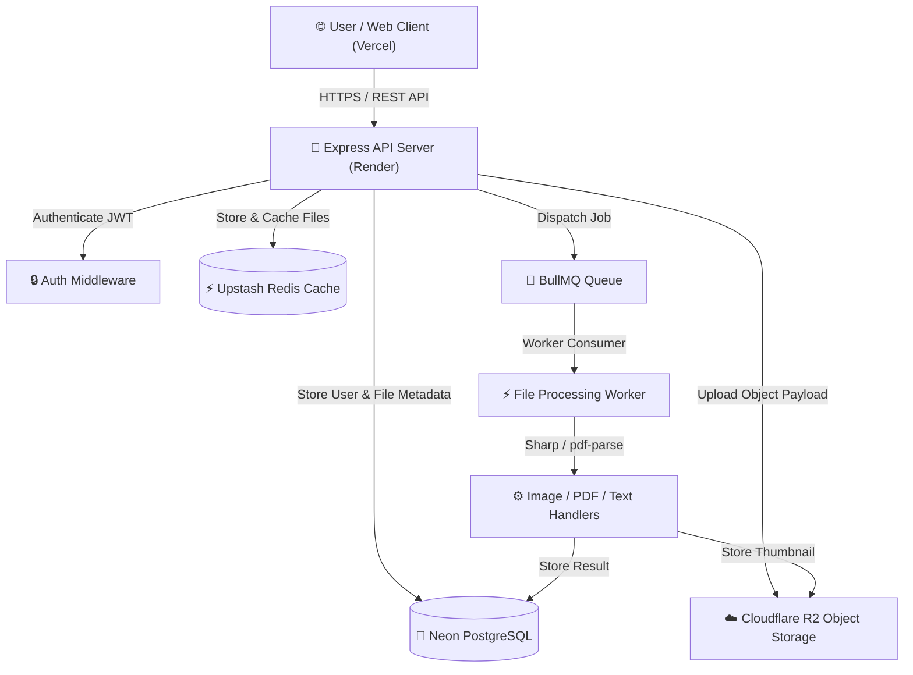

# PipelineX V1 — Production-Grade Asynchronous File Processing SaaS Engine

PipelineX V1 is an enterprise-ready, full-stack asynchronous file processing system built with Express, Node.js, React 19, TypeScript, Vite, Prisma, PostgreSQL 16 (Neon), Redis 7 (Upstash), BullMQ, Cloudflare R2 Object Storage, Sharp image processing, and pdf-parse text extraction.

---

## 🏗️ System Architecture



---

## 🚀 Key Features & Milestones

- **Milestone 1: Project Setup & Core Infrastructure**
  - Node.js + TypeScript strict ESM layout.
  - PostgreSQL & Redis containerized database setup.
  - RFC-7807 structured problem details error handling.

- **Milestone 2: Authentication & User Management**
  - User registration & login with `bcrypt` password hashing.
  - Short-lived JWT Access Tokens & Refresh Tokens.
  - Role-Based Access Control (`USER` & `ADMIN` roles).
  - Rate limiting on authentication routes.

- **Milestone 3: File Ingestion & Object Storage Layer**
  - Multer multipart file upload validation (PNG, JPEG, WEBP, PDF, TXT up to 20MB).
  - Storage abstraction supporting Cloudflare R2 / S3 bucket storage.
  - Secure signed download URL generation (15 min expiration).

- **Milestone 4: Async Queue & BullMQ Background Workers**
  - Event-driven background worker architecture powered by BullMQ & Redis.
  - Exponential backoff retry policies (3 attempts).
  - Non-blocking immediate file upload HTTP response.

- **Milestone 5: Pipeline Processing Handlers**
  - **Image Handler (`sharp`)**: Extracts width, height, format, color space, raw size, and generates 300x300 JPEG thumbnails stored under `thumbnails/{userId}/{uuid}.jpg`.
  - **PDF Handler (`pdf-parse`)**: Extracts total page count, document info metadata, and text content.
  - **Text Handler**: Computes line count, word count, character count, and stores UTF-8 content.
  - **ProcessingResult API**: `GET /api/v1/files/:id/result` returns processed metadata & presigned thumbnail link.

- **Milestone 6: Admin Dashboard, Queue Monitoring & Observability**
  - **Admin Dashboard**: `GET /api/v1/admin/dashboard` (aggregated users, files, storage consumption, average processing time).
  - **Queue Telemetry**: `GET /api/v1/admin/queue` (waiting, active, completed, failed, delayed job metrics).
  - **Job Inspection & Manual Retry**: `GET /api/v1/admin/jobs` & `POST /api/v1/admin/jobs/:jobId/retry`.
  - **Structured Logging**: Winston logger outputting to `logs/app.log` and `logs/error.log`.
  - **Enhanced Health Check**: `GET /health` inspecting DB, Redis, Cloudflare R2, BullMQ worker status, memory usage, and Node version.

- **Milestone 7: Security, API Protection, Caching & Performance**
  - Express rate limiting (`express-rate-limit`) on Auth, Upload, and Admin routes.
  - Security headers via Helmet (HSTS, CSP, X-Frame-Options, X-Content-Type-Options).
  - Response compression (`compression`) for responses > 1KB.
  - Redis cache layer for paginated file queries with automatic invalidation on file mutation.

- **Phase 2: Production Cloud Deployment Readiness**
  - GitHub Actions CI/CD pipeline (`.github/workflows/ci.yml`).
  - Production Docker multi-stage builds and Compose orchestration (`docker-compose.prod.yml`).
  - Cloud platform manifests: `render.yaml` (Backend Engine) and `web/vercel.json` (Frontend Client).
  - Production cloud infrastructure guide ([docs/deployment.md](file:///g:/PipelineX/docs/deployment.md)).

---

## 🛠️ Tech Stack

### Backend Engine
- **Runtime**: Node.js v20+, TypeScript
- **Web Framework**: Express v4
- **Database & ORM**: PostgreSQL 16, Prisma ORM
- **Queue & Cache**: Redis 7, BullMQ, ioredis
- **Object Storage**: Cloudflare R2 / S3 (`@aws-sdk/client-s3`)
- **Processing Engines**: Sharp, pdf-parse
- **Logging & Security**: Winston, Helmet, CORS, bcrypt, jsonwebtoken, Zod
- **Documentation**: Swagger UI (`/api/docs`)

### Frontend Dashboard Client
- **Framework**: React 19, Vite, TypeScript
- **Styling & UI**: Tailwind CSS v4, Lucide React, Framer Motion
- **State & Queries**: TanStack Query v5, Axios, React Hook Form, Zod

---

## 🌐 Cloud Deployment Architecture

| Component | Cloud Provider | Blueprint Config |
| :--- | :--- | :--- |
| **Frontend Client** | Vercel | [web/vercel.json](file:///g:/PipelineX/web/vercel.json) |
| **Backend API Engine** | Render | [render.yaml](file:///g:/PipelineX/render.yaml) |
| **Managed Database** | Neon PostgreSQL | Connection Pooling (`sslmode=require`) |
| **Managed Queue & Cache** | Upstash Redis | BullMQ & Redis Cache |
| **Object Storage** | Cloudflare R2 | S3 Compatible Bucket |

---

## 📖 API Documentation & Swagger UI

Interactive OpenAPI 3.0 documentation is available at:
`http://localhost:3000/api/docs`

---

## 🧪 Running Tests & Build Commands

### Backend Suite
```bash
npm test        # Run Jest unit & integration test suites
npm run build   # Compile TypeScript to dist/
```

### Frontend Suite
```bash
cd web
npm test        # Run Vitest unit & integration test suites
npm run build   # Compile Vite production build
```

---

## ⚡ Quickstart (Local Production via Docker Compose)

```bash
docker compose -f docker-compose.prod.yml up -d --build
```

- **Frontend App**: `http://localhost`
- **Backend API**: `http://localhost:3000`
- **Health Check**: `http://localhost:3000/api/v1/health`
