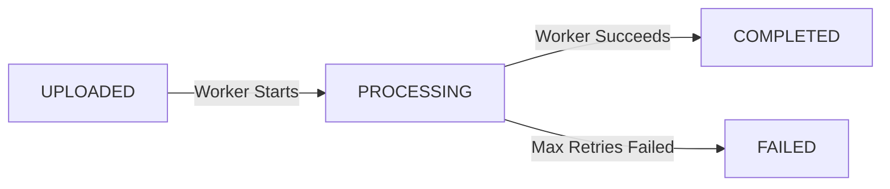

# Redis Queue & BullMQ Worker Architecture - PipelineX V1

PipelineX V1 uses **Redis** and **BullMQ** for asynchronous job processing, ensuring that heavy file processing workloads do not block HTTP request/response loops.

---

## 1. Queue Architecture

- **Queue Name**: `FileProcessingQueue`
- **Message Broker**: Redis 7 (via `ioredis`)
- **Job Retention**:
  - `removeOnComplete`: `true` (automatically cleans up successful jobs from Redis)
  - `removeOnFail`: `false` (retains failed jobs in Redis for audit & manual replay)

---

## 2. Job Payload Structure

Each job pushed to BullMQ contains light metadata references (file buffers are **never** included in Redis job payloads):

```typescript
interface FileProcessingJobPayload {
  fileId: string;      // PostgreSQL File UUID
  userId: string;      // User UUID
  storageKey: string;  // Cloudflare R2 / S3 Object Key
  mimeType: string;    // MIME type string
  uploadedAt: string;  // ISO timestamp
}
```

---

## 3. File Status State Machine

File statuses follow a strict single-direction state transition lifecycle inside PostgreSQL:



- **`UPLOADED`**: File successfully stored in R2 and metadata written to PostgreSQL. Job pushed to BullMQ.
- **`PROCESSING`**: BullMQ worker picked up job; simulated/actual execution in progress.
- **`COMPLETED`**: Processing completed successfully; output updated.
- **`FAILED`**: Job execution failed after exhausting 3 exponential retries.

---

## 4. Worker Lifecycle & Retry Configuration

- **Concurrency**: 5 parallel workers per node.
- **Max Retries**: `attempts: 3`.
- **Backoff Strategy**: Exponential backoff ($T = 2000 \times 2^{\text{attempt}}$ ms).

---

## 5. Endpoints

- `POST /api/v1/files/upload`: Enqueues job and returns immediately with `{ fileId, status: "UPLOADED", jobId }`.
- `GET /api/v1/files/:id/status`: Queries real-time execution status (`UPLOADED`, `PROCESSING`, `COMPLETED`, `FAILED`).
