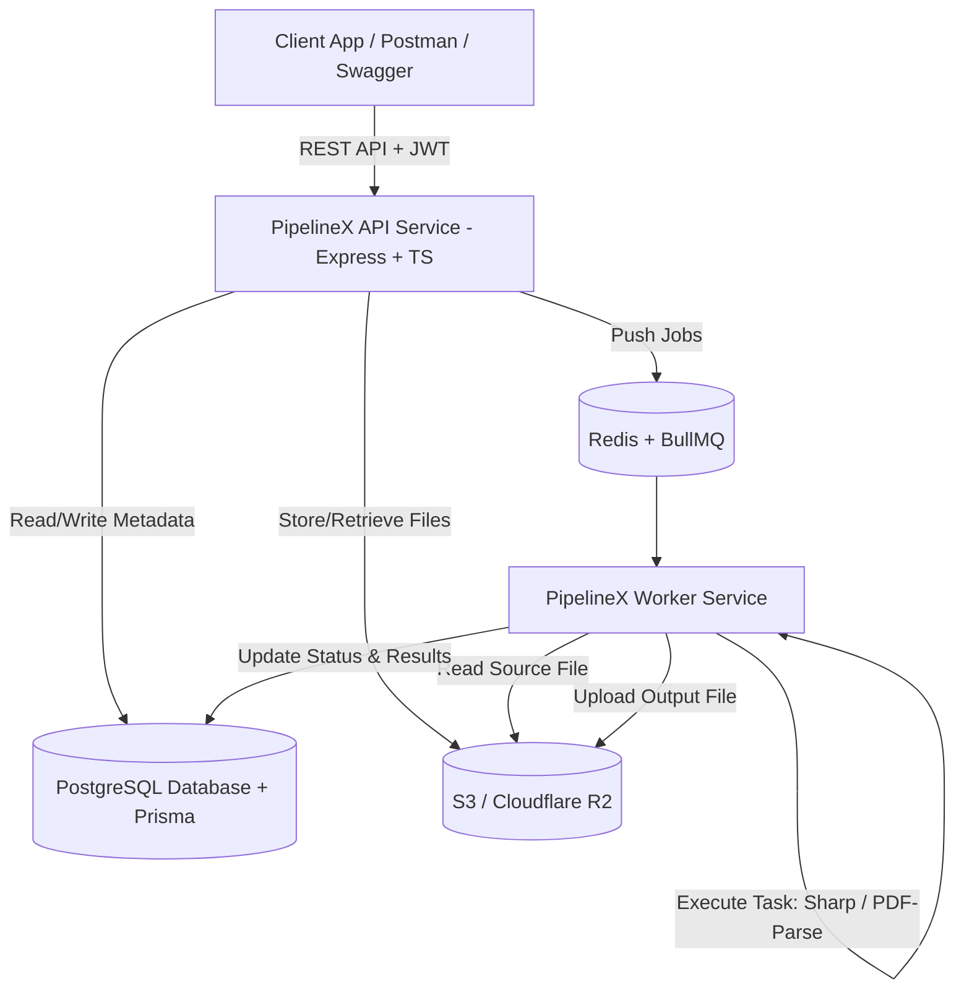

# System Architecture - PipelineX V1

PipelineX V1 uses a decoupled client-server architecture where API servers delegate heavy file processing workloads to asynchronous background workers.

## Core Components

1. **API Service (Express + TypeScript)**:
   - Serves REST endpoints for Auth, File Upload, and Job Management.
   - Validates incoming payloads using Zod schemas.
   - Interacts with PostgreSQL using Prisma ORM.
   - Enqueues jobs to Redis via BullMQ producers.

2. **Worker Service (BullMQ Worker)**:
   - Runs in a separate Node.js process.
   - Listens to the `file-processing-queue`.
   - Executes image resizing, PDF extraction, and word frequency tasks.
   - Writes processed artifacts to S3/R2 object storage and updates Prisma DB.

3. **Data Layer**:
   - **PostgreSQL 16**: Relational storage for users, file metadata, and job state history.
   - **Redis 7**: In-memory message broker for BullMQ job queue state & worker synchronization.
   - **Object Storage (S3 / Cloudflare R2)**: Storage for source uploads and processed artifacts.
